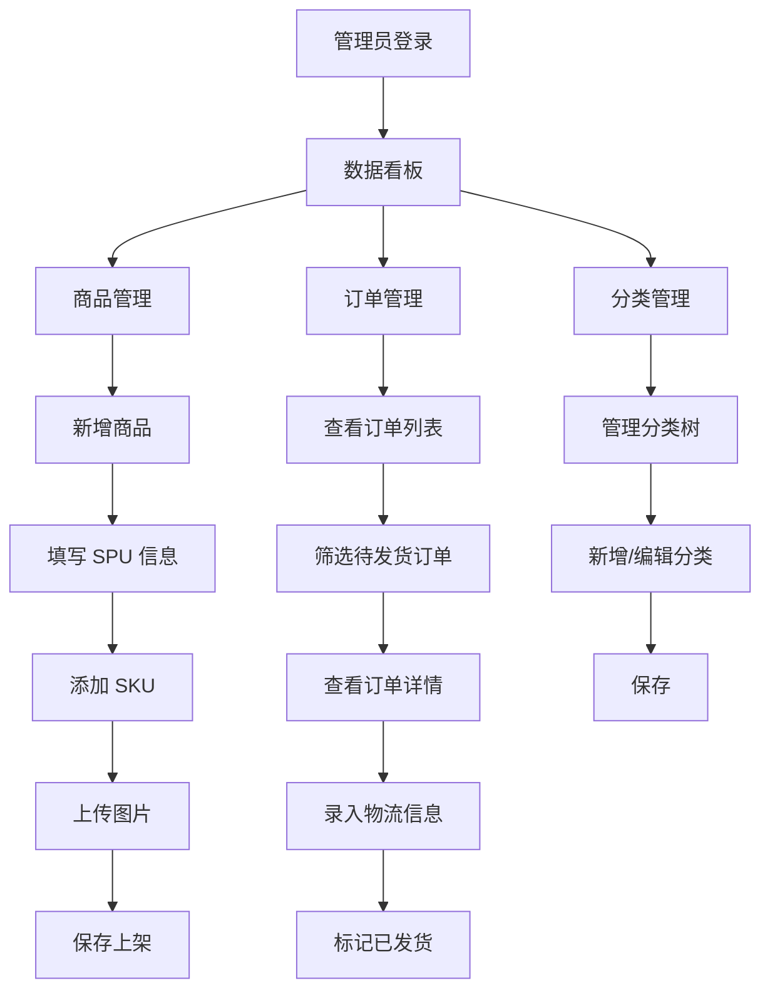

# 更懂它 — 商城后台管理系统 PRD

## 1. 产品概述

为「更懂它」宠物社区小程序的商城模块提供独立的 Web 后台管理系统，供运营/管理员进行商品上架管理、订单处理、库存追踪和数据监控。

- **目标用户**：商城运营人员、管理员
- **核心价值**：集中管理商品生命周期与订单流转，通过数据看板实时掌握商城运营状况
- **使用场景**：桌面端浏览器（优先 1280px+），兼顾平板端

## 2. 核心功能

### 2.1 用户角色

| 角色 | 注册方式 | 核心权限 |
|------|----------|----------|
| 管理员 | 系统内置/手动创建 | 全部功能（商品管理、订单处理、数据看板、分类管理） |
| 运营 | 管理员创建 | 商品管理、订单查看、数据看板（不可删除商品、不可修改系统设置） |

### 2.2 功能模块

1. **登录/认证**：管理员账号密码登录，JWT 令牌管理，登录态保持
2. **数据看板**：今日订单数、销售额、商品总数概览卡片；近 7/30 天销售趋势图；最近订单列表
3. **商品管理**：SPU/SKU 增删改查、库存管理、多语言（zh-CN/en-US）名称描述、图片上传
4. **订单管理**：订单列表（分页/筛选/搜索）、订单详情、发货操作、状态流转
5. **分类管理**：商品分类树形结构管理（增删改）

### 2.3 页面详情

| 页面名称 | 模块名称 | 功能描述 |
|----------|----------|----------|
| 登录页 | 登录表单 | 账号+密码登录，表单校验，错误提示 |
| 数据看板 | 概览卡片 | 4 张卡片展示今日订单数、销售额、商品总数、待处理订单 |
| 数据看板 | 销售趋势图 | 折线图展示近 7 天或 30 天销售额/订单量趋势 |
| 数据看板 | 最近订单 | 表格展示最近 5 条订单，支持跳转订单详情 |
| 商品列表 | 搜索筛选栏 | 按名称搜索、按分类筛选、分页 |
| 商品列表 | 商品表格 | 展示商品名称、分类、最低价、库存状态、操作按钮 |
| 商品新增/编辑 | 商品表单 | SPU 基本信息（中英文名、描述、分类、品牌），多图上传 |
| 商品新增/编辑 | SKU 管理 | 内嵌表格增删 SKU（规格编码、价格、成本价、重量） |
| 订单列表 | 筛选栏 | 按订单状态筛选、按时间范围、按订单号搜索、分页 |
| 订单列表 | 订单表格 | 订单号、用户、金额、支付状态、发货状态、操作按钮 |
| 订单详情 | 订单信息卡片 | 订单基本信息（单号、时间、金额、支付方式） |
| 订单详情 | 商品明细 | 订单项列表（商品名、数量、单价、小计） |
| 订单详情 | 收货信息 | 收货人姓名、电话、地址 |
| 订单详情 | 发货操作 | 选择物流商、输入快递单号 |
| 分类管理 | 分类树 | 树形结构展示分类层级，支持拖拽排序 |
| 分类管理 | 分类表单 | 新增/编辑分类（中英文名、编码、图标、排序） |

## 3. 核心流程

## 4. 用户界面设计

### 4.1 设计风格

- **色彩**：主色使用深蓝色系（#1e293b / slate-900）作为侧边栏背景，辅以暖橙色（#f59e0b / amber-500）作为交互高亮和强调色。内容区白色背景搭配浅灰卡片。
- **布局**：经典后台管理布局 —— 左侧固定侧边栏 + 右侧内容区，顶部有面包屑和用户信息栏。
- **字体**：系统原生中文字体栈（PingFang SC / Microsoft YaHei），英文和数字使用 Inter，保持清晰可读。
- **组件风格**：使用 shadcn/ui 默认风格，卡片式布局，圆角适中（rounded-lg），阴影柔和。
- **图标**：使用 Lucide Icons 图标集。

### 4.2 页面设计总览

| 页面名称 | 模块名称 | UI 元素 |
|----------|----------|---------|
| 登录页 | 登录表单 | 居中卡片布局，左侧品牌 Logo + 标语，右侧登录表单，柔和渐变背景 |
| 数据看板 | 概览卡片 | 4 列网格卡片，每张含图标、数值、标签，hover 微动效 |
| 数据看板 | 销售趋势图 | Recharts 面积图/折线图，响应式宽度 |
| 商品列表 | 搜索筛选栏 | 顶部工具栏：搜索框 + 分类下拉 + 新增按钮 |
| 商品列表 | 商品表格 | shadcn/ui DataTable，支持排序、分页 |
| 商品新增/编辑 | 商品表单 | 卡片分区表单，左侧主信息右侧预览（桌面端两栏） |
| 订单列表 | 筛选栏 | Tab 切换状态（全部/待支付/已支付/已发货/已完成）+ 日期范围选择器 |
| 订单详情 | 信息卡片 | 左右两栏布局：左侧订单+商品信息，右侧收货+物流操作 |
| 分类管理 | 分类树 | 可展开收起的树形列表，每行有编辑/删除/新增子节点按钮 |

### 4.3 响应式

- 桌面端优先（1280px+）：侧边栏展开 + 多栏布局
- 平板端（768-1279px）：侧边栏可收起，表格横向滚动
- 移动端（<768px）：不重点适配，仅保证基本可用

## 5. 非功能需求

- **安全性**：JWT 认证，Token 过期自动跳转登录，密码 bcrypt 加密
- **性能**：首屏加载 < 3s，表格分页加载
- **多语言**：商品名称和描述支持中英文双语言输入，后台界面本身仅中文
