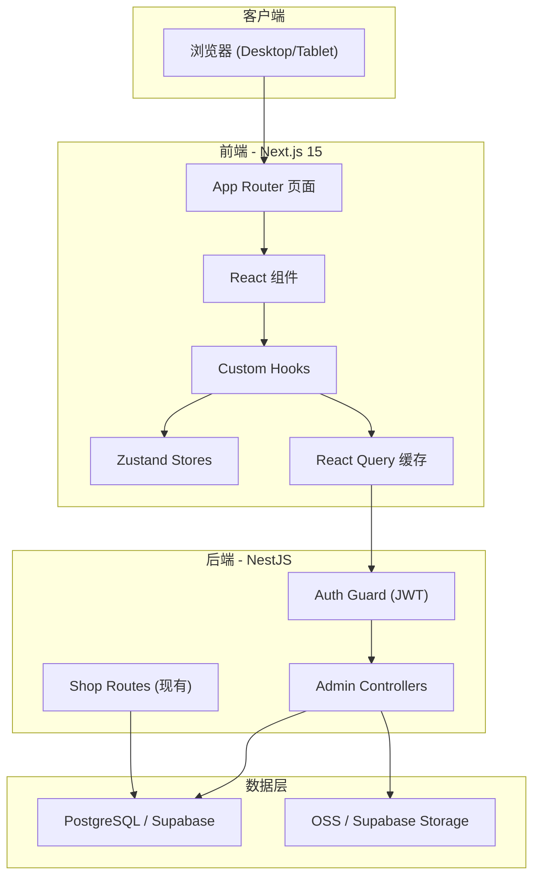
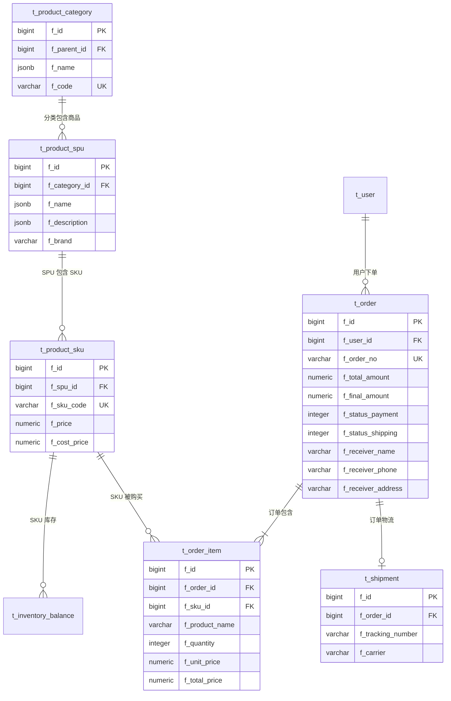

# 更懂它 — 商城后台管理系统 技术架构文档

## 1. 架构设计



## 2. 技术选型

| 层面 | 技术 | 版本 | 说明 |
|------|------|------|------|
| 前端框架 | Next.js | 15.x | App Router, 与现有技术栈一致 |
| 样式方案 | Tailwind CSS | 4.x | 原子化 CSS |
| 组件库 | shadcn/ui | latest | 基于 Radix UI, 可定制 |
| 表单校验 | React Hook Form + Zod | latest | 类型安全表单 |
| 状态管理 | Zustand | latest | 轻量全局状态 |
| 服务端状态 | TanStack React Query | v5 | 缓存与请求管理 |
| 图表 | Recharts | latest | React 图表库 |
| 图标 | Lucide React | latest | 开源图标集 |
| 包管理 | pnpm | latest | 与项目统一 |
| 语言 | TypeScript | 5.x | 类型安全 |

## 3. 路由定义

| 路由 | 页面 | 说明 |
|------|------|------|
| `/` | 重定向 | 未登录 → `/login`, 已登录 → `/dashboard` |
| `/login` | 登录页 | 管理员账号密码登录 |
| `/admin/dashboard` | 数据看板 | 概览卡片 + 趋势图 + 近期订单 |
| `/admin/products` | 商品列表 | 搜索/筛选/分页/表格 |
| `/admin/products/new` | 新增商品 | SPU + SKU 表单 |
| `/admin/products/[id]` | 编辑商品 | 编辑 SPU + 管理 SKU |
| `/admin/orders` | 订单列表 | 多状态筛选 + 分页表格 |
| `/admin/orders/[id]` | 订单详情 | 订单信息 + 商品明细 + 发货操作 |
| `/admin/categories` | 分类管理 | 分类树 + 增删改 |

## 4. API 定义

### 4.1 认证接口

```typescript
// POST /api/auth/admin/login
interface LoginRequest {
  username: string
  password: string
}
interface LoginResponse {
  code: number
  data: {
    token: string
    user: { id: number; username: string; role: string }
  }
}
```

### 4.2 商品管理

```typescript
// GET /api/admin/products?page=1&pageSize=20&search=&category=
// POST /api/admin/products
// PUT /api/admin/products/:id
// DELETE /api/admin/products/:id

interface ProductDTO {
  id?: number
  categoryId: number
  brand: string
  nameZh: string
  nameEn: string
  descZh: string
  descEn: string
  imageUrl: string
  skus: SkuDTO[]
}

interface SkuDTO {
  id?: number
  skuCode: string
  price: number
  costPrice?: number
  weight?: number
}

// GET /api/admin/dashboard
interface DashboardData {
  todayOrders: number
  todayRevenue: number
  totalProducts: number
  pendingOrders: number
}

// GET /api/admin/dashboard/trends?days=7
interface TrendData {
  date: string
  orders: number
  revenue: number
}[]
```

### 4.3 订单管理

```typescript
// GET /api/admin/orders?page=1&pageSize=20&status=&startDate=&endDate=&search=
// GET /api/admin/orders/:id
// PUT /api/admin/orders/:id/ship

interface OrderListResponse {
  code: number
  data: {
    list: OrderSummary[]
    total: number
    page: number
    pageSize: number
  }
}

interface OrderSummary {
  id: number
  orderNo: string
  userName: string
  totalAmount: number
  statusPayment: string
  statusShipping: string
  createdAt: string
}

interface OrderDetail {
  id: number
  orderNo: string
  userId: number
  userName: string
  totalAmount: number
  discountAmount: number
  finalAmount: number
  paymentMethod: string
  paymentStatus: string
  shippingStatus: string
  receiverName: string
  receiverPhone: string
  receiverAddress: string
  items: OrderItemDTO[]
  shipment?: ShipmentDTO
  createdAt: string
  updatedAt: string
}

interface OrderItemDTO {
  id: number
  productName: string
  quantity: number
  unitPrice: number
  totalPrice: number
}
```

### 4.4 分类管理

```typescript
// GET /api/admin/categories
// POST /api/admin/categories
// PUT /api/admin/categories/:id
// DELETE /api/admin/categories/:id

interface CategoryDTO {
  id?: number
  parentId: number
  code: string
  nameZh: string
  nameEn: string
  iconUrl: string
  order: number
}
```

## 5. 数据模型

本系统复用 PetChat 现有数据库表结构，主要涉及以下表：

- `t_product_category` — 商品分类（树形结构）
- `t_product_spu` — 商品 SPU（产品级）
- `t_product_sku` — 商品 SKU（售卖级）
- `t_inventory_balance` — 库存余额
- `t_inventory_movement` — 库存流水
- `t_order` — 订单主表
- `t_order_item` — 订单项
- `t_shipment` — 物流
- `t_user` — 用户（管理员角色通过 f_role 字段区分）



## 6. 项目目录结构

```
frontend/
├── src/
│   ├── app/
│   │   ├── layout.tsx              # 根布局
│   │   ├── page.tsx                # 根页面（重定向）
│   │   ├── login/
│   │   │   └── page.tsx            # 登录页
│   │   └── admin/
│   │       ├── layout.tsx          # 后台布局（侧边栏+顶栏+内容区）
│   │       ├── dashboard/
│   │       │   └── page.tsx        # 数据看板
│   │       ├── products/
│   │       │   ├── page.tsx        # 商品列表
│   │       │   ├── new/
│   │       │   │   └── page.tsx    # 新增商品
│   │       │   └── [id]/
│   │       │       └── page.tsx    # 编辑商品
│   │       ├── orders/
│   │       │   ├── page.tsx        # 订单列表
│   │       │   └── [id]/
│   │       │       └── page.tsx    # 订单详情
│   │       └── categories/
│   │           └── page.tsx        # 分类管理
│   ├── components/
│   │   ├── ui/                     # shadcn/ui 组件
│   │   ├── layout/
│   │   │   ├── admin-sidebar.tsx
│   │   │   ├── admin-header.tsx
│   │   │   └── admin-shell.tsx
│   │   ├── products/
│   │   ├── orders/
│   │   └── dashboard/
│   ├── lib/
│   │   ├── api.ts                  # API 客户端
│   │   ├── auth.ts                 # 认证工具
│   │   └── utils.ts                # 通用工具
│   ├── hooks/
│   │   ├── use-auth.ts
│   │   ├── use-products.ts
│   │   └── use-orders.ts
│   └── middleware.ts               # Next.js 中间件（认证守卫）
├── public/
├── package.json
├── tailwind.config.ts
├── tsconfig.json
└── next.config.ts
```

## 7. 安全设计

- **认证**：JWT Token 存储在 HttpOnly Cookie，前端通过 middleware.ts 在每次请求时校验
- **授权**：后端 Guard 校验 `role === 'admin'`，前端路由守卫检查登录态
- **CSRF**：SameSite=Strict Cookie
- **输入校验**：Zod schema 同时用于前端表单校验和后端 DTO 校验
- **XSS**：React 默认 XSS 防护，HttpOnly Cookie 防止 Token 窃取
