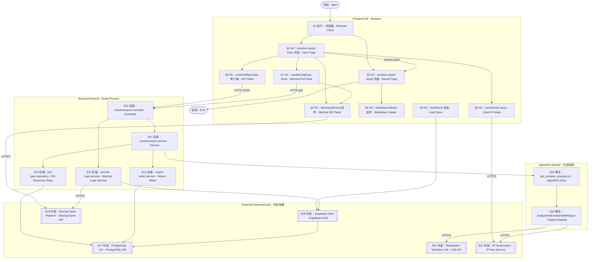
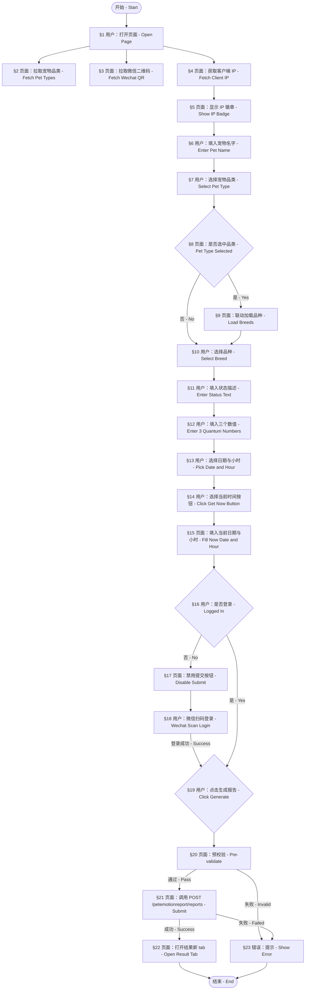
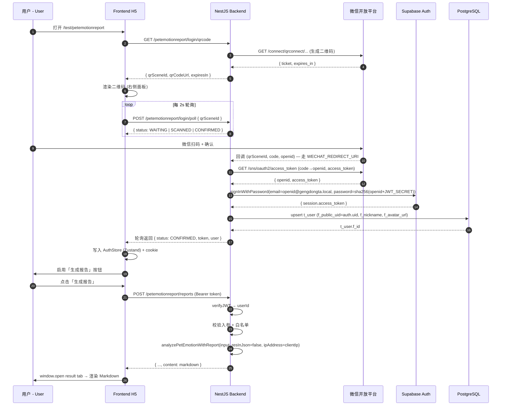
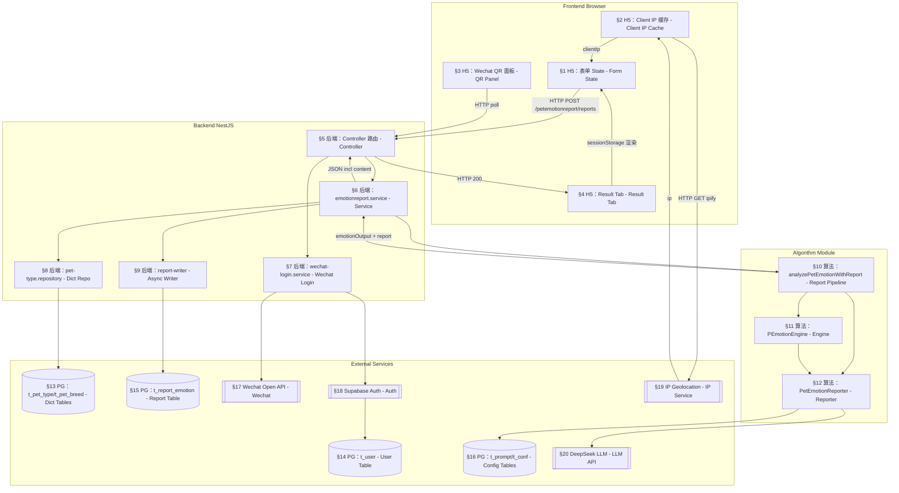
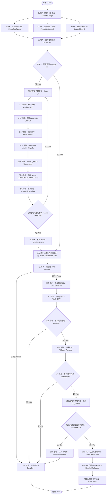

# Pet Emotion Report — 内部测试技术方案

> 内部测试代号：`petemotionreport`
> 目标：在 backend (NestJS) 提供 `petemotionreport` Service API，
> 在 frontend H5 提供 `/test/petemotionreport` 页面，调用 `backend/src/algorithm/pet_emotion_analysis.ts` 生成报告并展示。
> 文档版本：v1.1 · 2026-07-12

---

## 0. 阅读须知

### 0.1 命名约定

- **Edge Function**：特指由 Supabase 平台托管、运行在 Deno 边缘节点上的 serverless 函数（`Deno.serve(...)` 风格）。本项目 `backend/supabase/functions/<name>/index.ts` 即此形态。
- **Service API**：本方案新增的 NestJS 端点（`backend/src/emotionreport/...`），运行在 Node.js 长驻进程中。
- **算法 (Algorithm)**：`backend/src/algorithm/pet_emotion_analysis.ts` 暴露的 TypeScript 函数，**本方案唯一调用的三方模块**。

### 0.2 范围声明

**本设计完全忽略 `backend/supabase/` 目录下所有内容**，包括 Edge Functions、Supabase 客户端配置、数据库迁移脚本等。

仅复用：

- `backend/src/algorithm/pet_emotion_analysis.ts`（算法入口）
- `backend/src/algorithm/report/pet_emotion_report.ts`（报告层）
- `database/01_enums.sql`（t_pet_type / t_pet_breed 字典）

数据库访问、鉴权、登录、文件存储等，**全部由 NestJS service 直接对接 PostgreSQL / Supabase Auth / 微信开放平台**。不通过任何 Edge Function。

### 0.3 内容约束

本文档不出现任何与玄学、占卜、命理、神秘主义相关的词汇。所有"量子波动参数"等 UI 措辞仅作为用户输入界面的标签代号，对应算法层的 `careValue / perceptValue / intuitionValue` 三个数值输入。

---

## 1. 背景与目标

### 1.1 业务背景

仓库中已经存在一个完整的"情绪报告"实现链路（运行在 Supabase Edge Function 上，对接小程序端）。但其设计目标（小程序 + 占卜体系 + AI 文案生成）与本次内部测试需要的目标（浏览器 H5 + 单纯三数值 + 算法生成 Markdown 报告）不一致。

为避免命名冲突，本方案命名空间为 `petemotionreport`，并刻意与 `emotion-report` Edge Function 的路由分离。

### 1.2 目标

- 在 backend NestJS 中新增 `petemotionreport` Service API：
  - 提供宠物类型 / 品种字典查询
  - 提供报告生成端点（调用 `pet_emotion_analysis.ts`）
  - 集成微信开放平台扫码登录
- 在 frontend H5 提供 `/test/petemotionreport` 页面：
  - 输入界面（`emotion-report-input`）—— 按 `PetEmotionInput` meta 设计，UI 风格参考 `doc/ui/report/pet-emotion-report-input-ui.png`。
  - 报告展示界面（`emotion-report-result`）—— 新 tab，用支持 Markdown 渲染的组件展示后端返回的 `content`。
  - 获取客户端浏览器 IP（界面显示 + 提交时传给后端）。
- 集成 H5 微信扫码登录，未登录不可提交。

### 1.3 非目标

- 不修改或替换既有 `emotion-report` Edge Function。
- 不实现图片上传 / 拍照识别（UI 图中的图片上传区在本阶段被忽略）。
- 不实现多宠物档案管理。
- 不做正式上线 / CDN 部署，仅内部测试链路。
- 不在本期实现城市选择（移入备选功能集）。

---

## 2. 总体架构

### 2.1 组件拓扑图（flowchart TD）



### 2.2 部署形态

| 进程 | 路径 | 端口 | 备注 |
|---|---|---|---|
| Backend (NestJS) | `backend/src/main.ts` | 8001 | 已有，扩展注册 `EmotionReportModule` |
| Frontend H5 | `frontend/` | 3000 | Next.js 15 新建工程 |
| PostgreSQL | （独立实例，连接串见 env） | 5432 | 复用既有实例 |
| Supabase Auth | supabase.com | 443 | JWT 签发服务 |

---

## 3. Backend 设计

### 3.1 模块结构

新增模块 `EmotionReportModule`，遵循项目 `[domain].[type].ts` 命名规范：

| 文件 | 角色 |
|---|---|
| `backend/src/emotionreport/emotionreport.module.ts` | NestJS 模块，导出 Controller + Service |
| `backend/src/emotionreport/emotionreport.controller.ts` | 路由 `petemotionreport/*` |
| `backend/src/emotionreport/emotionreport.service.ts` | 业务编排（调用算法） |
| `backend/src/emotionreport/wechat-login/wechat-login.service.ts` | 微信扫码登录逻辑 |
| `backend/src/emotionreport/wechat-login/wechat-login.controller.ts` | 二维码 + 轮询路由 |
| `backend/src/emotionreport/pet-type/pet-type.repository.ts` | 字典查询 |
| `backend/src/emotionreport/report-writer/report-writer.service.ts` | 异步落库 |
| `backend/src/emotionreport/dto/generate-report.dto.ts` | 请求 DTO |
| `backend/src/emotionreport/dto/pet-type.dto.ts` | 字典 DTO |
| `backend/src/emotionreport/emotionreport.constants.ts` | 错误码、配置常量 |

模块在 `backend/src/app.module.ts` 中注册：

```text
AppModule.imports: [..., EmotionReportModule]
```

> 命名：service 名 `petemotionreport` 对应 controller 前缀 `petemotionreport`，路由前缀 `/petemotionreport`，与已存在的 `/emotion-report`（Edge Function）刻意区分。

### 3.2 API 端点

所有端点 base path：`/petemotionreport`
鉴权：除 `GET /petemotionreport/login/qrcode` 和 `POST /petemotionreport/login/poll` 外，其余均需 Header `Authorization: Bearer <jwt>`；JWT 由 Supabase Auth 签发。

| 方法 | 路径 | 用途 | 鉴权 |
|---|---|---|---|
| GET  | `/petemotionreport/pet-types` | 拉取所有宠物品类（来自 t_pet_type） | 公开 |
| GET  | `/petemotionreport/pet-types/:id/breeds` | 按品类拉取品种（来自 t_pet_breed） | 公开 |
| GET  | `/petemotionreport/login/qrcode` | 返回 H5 微信扫码登录二维码信息 | 公开 |
| POST | `/petemotionreport/login/poll` | 轮询扫码登录结果 | 公开 |
| POST | `/petemotionreport/reports` | 调用算法生成报告 | 必须登录 |

#### 3.2.1 GET /petemotionreport/pet-types

Response 200

```text
{
  "items": [
    { "id": 1, "name": "犬", "order": 1 },
    { "id": 2, "name": "猫", "order": 2 }
  ]
}
```

#### 3.2.2 GET /petemotionreport/pet-types/:id/breeds

Response 200

```text
{
  "items": [
    { "id": 11, "name": "金毛巡回犬", "petTypeId": 1 },
    { "id": 12, "name": "中华田园犬", "petTypeId": 1 }
  ]
}
```

#### 3.2.3 GET /petemotionreport/login/qrcode

Response 200

```text
{
  "qrSceneId": "uuid-v4",
  "qrCodeUrl": "https://mp.weixin.qq.com/cgi-bin/showqrcode?ticket=...",
  "expiresIn": 180
}
```

实现要点：调用微信开放平台 `qrconnect` 接口生成 ticket；sceneId 缓存在 backend 内存（`Map<sceneId, {status, openid?, createdAt}>`），TTL 180s。

#### 3.2.4 POST /petemotionreport/login/poll

Request

```text
{ "qrSceneId": "uuid-v4" }
```

Response 200（未扫码）

```text
{ "status": "WAITING" }
```

Response 200（已扫码未确认）

```text
{ "status": "SCANNED" }
```

Response 200（确认）

```text
{
  "status": "CONFIRMED",
  "token": "supabase-jwt",
  "user": { "id": 1, "nickname": "...", "avatarUrl": "..." }
}
```

Response 410（场景失效）

```text
{ "code": "SCENE_EXPIRED", "message": "二维码已过期，请刷新" }
```

#### 3.2.5 POST /petemotionreport/reports

Request DTO（直接对应 `PetEmotionInput` 字段）

| 字段 | 类型 | 必填 | 校验 |
|---|---|---|---|
| `petName` | string | 是 | length 1..32 |
| `petType` | string | 是 | 必须在 pet-types 返回的 name 列表内 |
| `petBreed` | string | 是 | 必须在对应品类的 breeds 列表内 |
| `careValue` | int | 是 | [1, 999] |
| `perceptValue` | int | 是 | [1, 999] |
| `intuitionValue` | int | 是 | [1, 999] |
| `questionText` | string | 是 | length 1..500 |
| `localDate` | string (YYYY-MM-DD) | 是 | 真实日期 |
| `localHour` | int (0..23) | 是 | 0..23 |
| `localMinute` | int (0..59) | 否 | 默认服务端当下分 |
| `localSecond` | int (0..59) | 否 | 默认服务端当下秒 |
| `clientIp` | string | 否 | 前端从浏览器获取的真实 IP，传给算法 `ipAddress` 字段 |
| `scenario` | enum | 否 | 缺省 `decision` |
| `resInJson` | bool | 否 | 缺省 `false`（报告是 Markdown） |

Response 200

```text
{
  "reportId": "uuid-v4",
  "petName": "小米",
  "finalVerdict": 1,
  "confidenceLevel": "high",
  "summary": "整体向好",
  "petPerspective": "...",
  "ownerPerspective": "...",
  "actionSuggestions": ["...", "..."],
  "riskPoints": ["..."],
  "timing": "...",
  "subjectStrength": 73,
  "objectStrength": 28,
  "castingTime": "2026-07-12T14:30:00.000Z",
  "algorithmVersion": "0.1.0",
  "content": "# 宠物心声报告 — 小米\n\n..."
}
```

`content` 字段即 `PetEmotionReportResult.content`（Markdown 字符串），由 `analyzePetEmotionWithReport` 生成。

#### 3.2.6 错误码

| code | http | 含义 |
|---|---|---|
| `UNAUTHORIZED` | 401 | 未登录 |
| `INVALID_PARAMS` | 400 | 入参校验失败（含品种联动、数值范围） |
| `RANGE_INVALID` | 400 | 三个数值不在 [1, 999] |
| `SCENE_EXPIRED` | 410 | 二维码失效 |
| `LLM_FAILED` | 503 | LLM 不可用（带 retry hint） |
| `INTERNAL` | 500 | 服务内部错误 |

### 3.3 业务编排（`emotionreport.service.ts`）

`generateReport(dto, userId)` 内部步骤：

1. 校验 `petType` / `petBreed` 白名单（前端已校验，后端必查兜底）。
2. 将 `localDate` + `localHour` + `localMinute` + `localSecond` 拼为 `Date`（用户时区假定 `Asia/Shanghai`，故 `timezoneOffset = 480`）。
3. 调用 `analyzePetEmotionWithReport(input)`：
   - `careValue` / `perceptValue` / `intuitionValue` / `questionText` 必填。
   - `petName` / `petType` / `petBreed` 注入。
   - `timestamp` = 步骤 2 拼出的 `Date`。
   - `timezoneOffset` = 480。
   - `resInJson` = `false`（**强制 Markdown 输出**，前端测试页固定值）。
   - `ipAddress` = `dto.clientIp`（来自浏览器，仅在合法 IPv4/IPv6 时传入）。
4. 拿到的 `{ emotionOutput, report }` 直接响应。
5. 异步写 `t_report_emotion`（**轻量写入**，`f_user_id` 必填、`f_pet_id` 缺省为 `-1`、快照入 `f_llm_input`、`f_meta` 存 `algorithmVersion`、`f_status=10`），不阻塞响应。
6. 不做配额限制（内部测试）。

### 3.4 类别/品种查询实现

NestJS 端通过 `pg` 客户端直连（已有 `database/database.service.ts`），执行两条 SQL：

```text
SELECT f_id, f_name->>'zh-CN' AS name, f_order
  FROM public.t_pet_type
 WHERE f_deleted = 0
 ORDER BY f_order ASC;

SELECT f_id, f_name->>'zh-CN' AS name, f_pet_type_id
  FROM public.t_pet_breed
 WHERE f_pet_type_id = $1 AND f_deleted = 0
 ORDER BY f_order ASC;
```

> 数据表定义见 `database/01_enums.sql`（t_pet_type / t_pet_breed）。

### 3.5 环境变量与 Key（`backend/.env.test`）

| 变量 | 用途 | 备注 |
|---|---|---|
| `SUPABASE_URL` | Supabase 项目 URL | 已有 |
| `SUPABASE_PUBLISHABLE_KEY` | supabase-js 客户端 | 已有 |
| `SUPABASE_PASSWORD` | 直连 PG 密码 | 已有 |
| `SUPABASE_DB_URL` | PG 直连 | 已有 |
| `LLM_API_URL` | LLM 入口 | 已有 |
| `LLM_API_KEY` | LLM key | 已有 |
| `LLM_MODEL` | 模型名 | 已有 |
| `JWT_SECRET` | 自签 token 备用 | 已有 |
| `SERVER_PORT` | NestJS 端口 | 已有 8001 |
| `WECHAT_APPID` | 微信开放平台 appid | 已有（与小程序共用同一个变量） |
| `WECHAT_SECRET` | 微信开放平台 appsecret | 已有 |
| `WECHAT_REDIRECT_URI` | H5 扫码回调 | 新增 |
| `WECHAT_LOGIN_SCOPE` | `snsapi_login` | 新增 |
| `WECHAT_LOGIN_TTL_SEC` | 二维码 TTL | 新增，默认 180 |
| `PETEMOTIONREPORT_LLM_TIMEOUT_MS` | LLM 超时 | 新增，默认 30000 |
| `PETEMOTIONREPORT_LLM_TEMPERATURE` | 透传 temperature | 新增，默认 0.65 |
| `PETEMOTIONREPORT_DEFAULT_TIMEZONE_OFFSET` | 默认时区偏移 | 新增，默认 480 |

> 写入 `.env.test` 时**保留**所有已有键，仅追加；不要覆盖 `WECHAT_APPID` / `WECHAT_SECRET` / `LLM_*` 字段。

---

## 4. 算法集成要点

`backend/src/algorithm/pet_emotion_analysis.ts` 是既成算法，本方案**不修改**。

调用形态（与算法文件保持一致）：

- 仅一个内部入口：`analyzePetEmotionWithReport(input)`。
- 算法内部会自动 `getConfig()` 一次拉取 t_conf 报告层配置，**前提是 t_conf / t_prompt 已 seed**。若 t_prompt 缺失，`PetEmotionReporter` 构造时会 fail-fast。
- `PEmotionEngine` 实例每次新建（无状态）。
- `ipAddress` 字段由前端浏览器获取的 IP 传入，**不读取** HTTP header 中的 `x-forwarded-for`。

> 详见 `backend/src/algorithm/pet_emotion_analysis.ts` 第 379-428 行。

---

## 5. Frontend H5 设计

### 5.1 工程结构

新建 Next.js 15 (App Router) 工程，路径 `frontend/`。

```text
frontend/
├── app/
│   ├── test/
│   │   └── petemotionreport/
│   │       ├── page.tsx                # emotion-report-input（输入主页）
│   │       └── result/
│   │           └── page.tsx            # emotion-report-result（报告展示）
│   ├── layout.tsx
│   └── page.tsx                        # 默认重定向到 /test/petemotionreport
├── components/
│   ├── EmotionReportInputForm.tsx
│   ├── PetTypeSelect.tsx
│   ├── PetBreedSelect.tsx
│   ├── QuantumNumberInput.tsx
│   ├── DateTimePanel.tsx
│   ├── ClientIpBadge.tsx
│   ├── WechatQrPanel.tsx
│   ├── GenerateReportButton.tsx
│   └── MarkdownViewer.tsx              # react-markdown + remark-gfm
├── hooks/
│   ├── useClientIp.ts
│   ├── useWechatScan.ts
│   ├── usePetTypes.ts
│   ├── usePetBreeds.ts
│   └── useEmotionReport.ts
├── lib/
│   ├── api/
│   │   └── emotionReportApi.ts
│   └── auth/
│       ├── authStore.ts                # Zustand
│       └── tokenCookie.ts
└── .env.test
```

### 5.2 路由

- `/test/petemotionreport` → 输入主页 `emotion-report-input`。
- `/test/petemotionreport/result` → 报告展示页 `emotion-report-result`，**新 tab**（`target="_blank"`）打开。

### 5.3 输入页（emotion-report-input）

布局：**整体居中（max-w-[640px] mx-auto）**，忽略 UI 图中的图片上传；客户 IP 徽章在表单顶部；微信二维码面板固定在右侧（桌面端 ≥ md 断点）。



#### 5.3.1 字段定义

| 字段 | UI 组件 | meta 对应 | 备注 |
|---|---|---|---|
| 客户端 IP | `ClientIpBadge` | `clientIp` | 自动获取 + 显示 readonly |
| 宠物名字 | text input | `petName` | 必填 |
| 宠物品类 | cascading select | `petType` | 来自 `/petemotionreport/pet-types` |
| 宠物品种 | cascading select | `petBreed` | 联动品类；未选品类时禁用 |
| 状态描述 | textarea | `questionText` | 必填，max 500 |
| 牵挂值 | number input | `careValue` | [1, 999] 整数 |
| 感知值 | number input | `perceptValue` | [1, 999] 整数 |
| 直觉值 | number input | `intuitionValue` | [1, 999] 整数 |
| 日期 | date picker | `localDate` (YYYY-MM-DD) | 必填 |
| 小时 | hour select (0..23) | `localHour` | 必填 |
| 分钟 | text (read-only) | `localMinute` | 仅显示当下分，不可修改 |
| 秒钟 | text (read-only) | `localSecond` | 仅显示当下秒，不可修改 |
| 获取当前按钮 | button | n/a | 点击 → 写入 today + currentHour；分秒同步显示 |
| 生成报告 | submit button | n/a | 未登录 disabled |

#### 5.3.2 客户端 IP 获取

实现位置：`hooks/useClientIp.ts`。

策略（**仅取真实公网 IP**，避免 local / loopback）：

1. 优先调用 `https://api.ipify.org?format=json` → 拿 `ip` 字段。
2. 失败时回退 `https://ifconfig.me/ip`（纯文本）。
3. 两次都失败时显示 "无法获取"，提交时不传 `clientIp`。
4. 校验：仅放行 IPv4 / IPv6 字面量；本地 / 私有段（127.x / 10.x / 192.168.x / 172.16-31.x / ::1）打回。

展示位置：表单顶部 `ClientIpBadge`，样式为"标签：值（来源）"，可点击"重新获取"。

传递：写入表单 state `clientIp`，提交时随其他字段一起 `POST /petemotionreport/reports`。

#### 5.3.3 微信二维码面板（输入页右侧）

固定 240×240 区域，显示二维码图片 + "请使用微信扫码登录" 提示。
来源：`GET /petemotionreport/login/qrcode`。
轮询：`useWechatScan` hook 每 2 秒 `POST /petemotionreport/login/poll` 直到 `status === "CONFIRMED"`。

#### 5.3.4 布局示意

```text
+--------------------------------------------------+
|  客户端 IP：203.0.113.42 (ipify)        [刷新]     |
+--------------------------------------------------+
|  PetChat · 宠物心声报告（内部测试）                |
+--------------------------------------------------+
|  宠物名字：[____________________]                 |
|  宠物品类：[犬 ▼]  品种：[金毛 ▼]                  |
|  状态描述：                                      |
|  [_________________________________________]    |
|                                                  |
|  +----------------+  +-------------------+      |
|  | 日期 2026-07-12 |  | 小时 14  分 35  秒 12 |  |
|  | [获取当前时间]   |  +-------------------+      |
|  +----------------+                              |
|                                                  |
|  牵挂值 [__]   感知值 [__]   直觉值 [__]          |
|                                                  |
|              [ 生成宠物心声报告 ]                  |
|                                                  |
|  +--------------------+                          |
|  |  [微信扫码登录二维码] |   ← 右侧固定 240×240     |
|  |  请使用微信扫码登录  |                          |
|  +--------------------+                          |
+--------------------------------------------------+
```

#### 5.3.5 提交逻辑

`useEmotionReport.submit(payload)`：
1. 走前端预校验（数值范围、品种联动）。
2. **强制** payload 中 `resInJson: false`（前端硬编码，不允许覆盖）。
3. `POST /petemotionreport/reports`。
4. 200 → `window.open('/test/petemotionreport/result?reportId=...', '_blank')`，将 `result` 也写入 `sessionStorage`（避免依赖 url 编码 Markdown）。
5. 非 200 → toast 错误。

### 5.4 结果页（emotion-report-result）

布局：居中卡片，最大宽度 720px，正文用 `<MarkdownViewer content={...} />` 渲染。

`MarkdownViewer`：
- 选 `react-markdown` + `remark-gfm`。
- 代码块用 `react-syntax-highlighter`（Dracula 主题，浅色背景时切 github 主题）。
- 标题、列表、表格、引用走默认样式 + tailwind prose。
- 配合 `rehype-sanitize` 防 XSS。

`content` 来源：
- 主：`sessionStorage.getItem('petemotionreport:result')`。
- 次：`sessionStorage` 缺失时回落到查询参数 `reportId`（本期暂不实现 GET 详情端点，直接报错"请重新生成"）。

页面 action：
- 复制 Markdown 原文
- 下载 .md 文件
- 关闭 tab 返回

### 5.5 前端环境变量（`frontend/.env.test`）

| 变量 | 用途 |
|---|---|
| `NEXT_PUBLIC_API_BASE` | `http://localhost:8001` |
| `NEXT_PUBLIC_WECHAT_QR_POLL_INTERVAL_MS` | 2000 |
| `NEXT_PUBLIC_WECHAT_QR_EXPIRE_SEC` | 180 |
| `NEXT_PUBLIC_IPV4_SERVICE_PRIMARY` | `https://api.ipify.org?format=json` |
| `NEXT_PUBLIC_IPV4_SERVICE_FALLBACK` | `https://ifconfig.me/ip` |

---

## 6. 鉴权与登录流程

### 6.1 总体时序



### 6.2 微信扫码登录实现要点

**H5 端必须用「开放平台 / 扫码登录」流程**，与小程序的 `wx.login()` 是不同入口。

1. 前端请求 backend `GET /petemotionreport/login/qrcode`。
2. backend 调 `https://open.weixin.qq.com/connect/qrconnect?appid=...&redirect_uri=...&response_type=code&scope=snsapi_login&state={qrSceneId}` 拿 ticket。
3. 二维码图片 URL：直接拼接 `https://mp.weixin.qq.com/cgi-bin/showqrcode?ticket={ticket}` 返回前端。
4. 用户扫码后微信回调 `WECHAT_REDIRECT_URI?code=...&state={qrSceneId}`，backend 端点收到 code 后：
   - 调 `https://api.weixin.qq.com/sns/oauth2/access_token?appid=...&secret=...&code=...&grant_type=authorization_code` 拿 `openid` + `access_token`。
   - 派生稳定密码：`sha256(openid + JWT_SECRET)` → base64。
   - `supabase.auth.signInWithPassword` 拿 JWT。
   - 写 `t_user`（与既有 emotion-report 流程一致）。
   - 把 `(qrSceneId → { status: 'CONFIRMED', token, user })` 写回内存 Map，触发前端轮询成功。
5. 前端轮询拿到 token 后写 `document.cookie` 的 `petemotionreport_token`（`Secure; SameSite=Lax`），并写 Zustand store。

### 6.3 Token 传递

- 前端：所有 `/petemotionreport/*` 请求 Header `Authorization: Bearer <token>`。
- 后端：用 `@supabase/supabase-js` + service role key 解析 `Authorization: Bearer ...` → 拿 `auth.uid` → 查 `t_user.f_public_uid` → 返回 `f_id`。
- 不引入新的 JWT 签发，**直接复用 Supabase Auth**。

---

## 7. 数据流向图



---

## 8. 端到端流程图



---

## 9. 错误处理与边界

| 场景 | 行为 |
|---|---|
| 三数值越界 | 后端返 `RANGE_INVALID`，前端 toast 并回显至输入框 |
| 品类/品种不联动 | 切换品类时清空品种；提交时后端二次校验 |
| 时间戳异常（用户传未来日期） | 后端不强校验，留审计；UI 提示"建议使用当前时间" |
| LLM 超时 | `LLM_FAILED` 503，前端显示"AI 服务暂时不可用" + 重试按钮 |
| 二维码过期 | `SCENE_EXPIRED` 410，前端显示"二维码已过期，点击刷新" |
| Token 失效 | 后端 401，前端 `useEmotionReport` 重试一次（force re-login） |
| IP 获取失败 | `clientIp` 留空，不传给算法；前端 badge 显示"无法获取" |
| `pet_emotion_analysis` 内部抛错 | `INVALID_TIMEZONE_OFFSET` 等 → `INVALID_PARAMS` |
| `resInJson` 字段被前端覆盖 | 后端忽略，强制 `resInJson = false` |

---

## 10. 安全

- 所有 `/petemotionreport/reports` 端点必须登录（Bearer token）。
- `petName` / `questionText` 写入 `t_report_emotion.f_llm_input` 时原样存，但**仅本人**可读（RLS）。
- `.env.test` 中所有 key 不进 git；只允许 `local` 链路使用。
- 二维码 scene TTL 180s，sceneId 不可预测（UUID v4），过期立即失效。
- CORS：仅允许 `http://localhost:3000` 与 `*.gengdongta.com`（生产域名占位）。
- Markdown 渲染走 `rehype-sanitize`，防 LLM 注入 `<script>`。
- `clientIp` 服务端二次校验格式；私有段、loopback 段打回。

---

## 11. 部署与运行

### 11.1 本地启动

```text
# Backend
cd backend
pnpm install
node --env-file=.env.test -r dotenv/config src/main.ts
# 监听 :8001

# Frontend
cd frontend
pnpm install
pnpm dev
# 监听 :3000
```

### 11.2 烟测用例（手工）

1. 打开 `http://localhost:3000/test/petemotionreport`，检查 IP 徽章、宠物名字输入、品类联动、微信二维码。
2. 微信扫码登录 → 按钮启用。
3. 输入 3 个数字（每个 1-999） + 状态描述 + 当前时间。
4. 点击"生成宠物心声报告"。
5. 新 tab 显示 Markdown 报告；返回主 tab 状态保留；IP 与表单填值一致。

---

## 12. 备选功能集（本期不实现）

| 功能 | 说明 | 何时启用 |
|---|---|---|
| 城市选择 | UI 增加城市下拉；后端在算法 `ipAddress` 不可用时回退为查 IP 归属城市；写死中国 GDP Top 20 城市。 | 需要脱机或 IP 不可用时 |
| 图片上传 | UI 图中的"上传照片"模块；后端需新增 OSS 适配器。 | 报告需要参考图时 |
| 历史报告列表 | 新增 `GET /petemotionreport/reports`，按用户过滤。 | 多用户回归时 |
| 测试账号 mock 登录 | `POST /petemotionreport/login/mock`，直接返回 token，跳过微信扫码。 | 无微信账号开发环境 |
| 配额限制 | 引入 `t_feature_quota` + `t_usage_record`。 | 正式上线前 |
| 多语言 i18n | 接入 `react-i18next`。 | 国际化时 |
| 埋点 / 监控 | 接入 Sentry + Prometheus。 | 正式上线前 |
| 报告分享 / 导出 PDF | 在结果页增加"分享给好友"与"导出 PDF"。 | 用户运营时 |
| AI 流式输出 | `analyzePetEmotionWithReport` 改为 SSE 流式。 | 报告生成耗时 > 3s 时 |

---

## 13. 文件清单（不写代码，只列落点）

| 路径 | 角色 |
|---|---|
| `backend/src/emotionreport/emotionreport.module.ts` | 新增 |
| `backend/src/emotionreport/emotionreport.controller.ts` | 新增 |
| `backend/src/emotionreport/emotionreport.service.ts` | 新增 |
| `backend/src/emotionreport/wechat-login/wechat-login.service.ts` | 新增 |
| `backend/src/emotionreport/wechat-login/wechat-login.controller.ts` | 新增 |
| `backend/src/emotionreport/pet-type/pet-type.repository.ts` | 新增 |
| `backend/src/emotionreport/report-writer/report-writer.service.ts` | 新增 |
| `backend/src/emotionreport/dto/generate-report.dto.ts` | 新增 |
| `backend/src/emotionreport/dto/pet-type.dto.ts` | 新增 |
| `backend/src/emotionreport/emotionreport.constants.ts` | 新增 |
| `backend/src/app.module.ts` | 修改（imports + EmotionReportModule） |
| `backend/.env.test` | 追加 WECHAT_REDIRECT_URI / WECHAT_LOGIN_SCOPE / WECHAT_LOGIN_TTL_SEC / PETEMOTIONREPORT_* |
| `frontend/app/test/petemotionreport/page.tsx` | 新增 |
| `frontend/app/test/petemotionreport/result/page.tsx` | 新增 |
| `frontend/components/EmotionReportInputForm.tsx` | 新增 |
| `frontend/components/PetTypeSelect.tsx` | 新增 |
| `frontend/components/PetBreedSelect.tsx` | 新增 |
| `frontend/components/QuantumNumberInput.tsx` | 新增 |
| `frontend/components/DateTimePanel.tsx` | 新增 |
| `frontend/components/ClientIpBadge.tsx` | 新增 |
| `frontend/components/WechatQrPanel.tsx` | 新增 |
| `frontend/components/GenerateReportButton.tsx` | 新增 |
| `frontend/components/MarkdownViewer.tsx` | 新增 |
| `frontend/hooks/useClientIp.ts` | 新增 |
| `frontend/hooks/useWechatScan.ts` | 新增 |
| `frontend/hooks/usePetTypes.ts` | 新增 |
| `frontend/hooks/usePetBreeds.ts` | 新增 |
| `frontend/hooks/useEmotionReport.ts` | 新增 |
| `frontend/lib/api/emotionReportApi.ts` | 新增 |
| `frontend/lib/auth/authStore.ts` | 新增 |
| `frontend/.env.test` | 新增 |

---

## 14. 建议 (Suggestions)

> 以下是基于经验的方案建议，请用户决定是否采纳。

1. **路由命名**：建议把 controller 前缀从 `petemotionreport` 改为 `pet-emotion-report`（kebab-case）。`petemotionreport` 内部测试代号仍可在代码注释/日志中使用。
2. **写入 t_report_emotion 异步化**：建议加 try/catch 记录失败，避免脏数据导致日志噪音；或用后台队列（BullMQ），但本期不建议引入。
3. **Markdown 渲染安全**：建议使用 `react-markdown` 配合 `rehype-sanitize`，防止 LLM 注入 `<script>`。
4. **缓存 pet-types**：建议用 Next.js `fetch` 缓存或后端 LRU 内存缓存（TTL 5 分钟）以减少 PG 直连。
5. **t_conf / t_prompt 缺失**：算法内部会因 `PetEmotionReporter` 构造 fail-fast 而整个 503，建议在 `emotionreport.service.ts` 启动时跑一次 `dryRun` 健康检查，提前暴露。
6. **城市 Top 20 排序依据**：建议显式注释"按 2024 年 GDP 排名"，避免未来质疑排序合理性。
7. **微信登录态与现有 t_user 兼容**：派生邮箱采用 `${openid}@wechat.gengdongta.local` 与现有 `wechat-auth` 一致，确保同一微信号 H5 / 小程序登录后 `t_user.f_id` 相同。
8. **结果页 Markdown 大小**：LLM 输出可能 4k+ tokens，sessionStorage 容量足够（5-10MB），但建议前端在 result 页面提供"下载 .md"按钮，方便测试人员归档。
9. **i18n**：本期仅 zh-CN，但建议把 i18n 框架（`react-i18next`）先埋好，避免后续 H5 多语言时大改。
10. **测试用例**：建议补充单测（`vitest`）：
    - 数值越界
    - 城市白名单
    - 品类品种联动
    - 登录态失效
    - `clientIp` 格式校验（IPv4/IPv6 + 排除私有段）
11. **客户端 IP 隐私**：本设计是内部测试无问题；若未来面向真实用户，建议改为"前端不显示 IP，仅传给后端"，避免暴露用户网络位置。
12. **结果 tab 持久化**：sessionStorage 跨浏览器失效，跨 tab 共享。**对内部测试 OK**，但正式上线建议落库并用 `reportId` 拉取。
13. **限流**：本期不限制调用次数；正式上线前应加 `RateLimitGuard`。

---

## 15. Open Issues（待用户确认）

1. **`petemotionreport` 命名**：用户明确要求使用此名，是否就以此为 controller 前缀？还是仅作为内部代号，前缀用 `pet-emotion-report`？
2. **结果页是新 tab 还是 modal**：用户写"弹出另外一个 tab"，按字面理解为新 tab。如有特殊要求请说明。
3. **结果是否持久化**：方案默认**轻量写入 t_report_emotion**（无 f_pet_id 关联）。是否需要新建一张 `t_petemotionreport` 表？这会涉及 DB migration。
4. **三个数值与 UI 文本映射**：UI 图中"宠物牵挂值/活力感知值/心声直觉值" 与算法 `careValue / perceptValue / intuitionValue` 是否一致？默认按 `careValue=牵挂值, perceptValue=感知值, intuitionValue=直觉值` 映射，请确认。
5. **时间字段最终单位**：用户要求"分秒只显示当前分秒，不能修改"。后端 `timestamp` 是否使用前端传过来的固定分秒？还是算法内部仍然用 `new Date()`？建议**后端直接使用前端时间拼 Date**，并在响应中回显便于调试。
6. **测试账号**：内部测试阶段使用什么 openid 触发？是否需要 backend 提供一个"测试登录"端点（mock openid），让不接入真微信也能跑通流程？
7. **IP 失败时是否阻塞提交**：当前方案是 IP 失败仅 badge 显示警告，不阻塞。是否需要强制要求 IP？
8. **H5 与现有小程序关系**：是否意味着同一微信账号在 H5 / 小程序可登录并共享 `t_user`？默认是。
9. **是否集成埋点 / 监控**：本期不集成。是否需要？
10. **结果保存为 .md / .pdf**：是否需要支持下载？（建议：支持 .md 即可）

---

## 16. 风险

| 风险 | 等级 | 缓解 |
|---|---|---|
| `t_prompt` / `t_conf` 未 seed 导致算法 fail-fast | 高 | 启动时 dry-run；文档写明 seed 步骤 |
| 微信开放平台申请审核周期 | 高 | 内部测试可用测试公众号；正式上线需 ICP 备案 |
| LLM 输出长 Markdown 解析错误 | 中 | Markdown 解析失败时回退原文 + 错误提示 |
| sessionStorage 跨 tab 隔离 | 中 | 用 `window.open` + 同源，sessionStorage 共享；跨浏览器则失效 |
| IP Geolocation 服务不稳定 | 中 | 双源回退；本地缓存最近一次成功值 |
| H5 微信扫码需开放平台账号（区别于小程序 AppID） | 高 | 需用户在微信开放平台 https://open.weixin.qq.com 申请"网站应用" |
| `clientIp` 暴露用户位置 | 中 | 内部测试可接受；正式上线隐藏 |

---

## 17. 参考设计

> 本节是从一个**外部参考实现**的设计分析，仅作为设计参考。参考实现的形态是「后端一个 serverless 函数 + 前端一个原生小程序端」，与本设计「NestJS 服务 + H5 浏览器」形态不同；以下分析其**设计亮点**，并评估哪些可以借鉴到本设计。

### 17.1 参考实现：后端模块设计

**模块结构**

- 单一函数文件 + `_shared/` 公共模块（cors / errors / auth / db / ai）
- 每个函数独立部署、独立配额
- 函数内聚了"鉴权 → 配额检查 → DB 查询 → 拼 prompt → 调 LLM → 解析 → 落库 → 记录用量"全链路

**亮点分析**

1. **公共模块抽离干净**：`cors / errors / auth / db / ai` 五件套清晰分层，函数主体只关心业务。本设计有 7 个子模块，**建议同步把"错误响应、Auth 校验、配额检查、LLM 调用"也抽到 `backend/src/emotionreport/_shared/`，避免在 service 中重复实现**。
2. **错误码语义统一**：定义了 `UNAUTHORIZED / FORBIDDEN / NOT_FOUND / QUOTA_EXCEEDED / INVALID_PARAMS / AI_FAILED / UPLOAD_FAILED` 等常量错误码。本设计 §3.2.6 已部分对齐，**建议补齐 `NOT_FOUND` 与 `UPLOAD_FAILED`（即使本端点未直接使用，也保持未来扩展一致）**。
3. **Prompt 模板从 t_prompt 表读，prompt 版本化**：保证报告文案可回溯、可灰度。本设计**直接复用 `pet_emotion_report.ts` 的现有机制**，不重新设计，**已对齐**。
4. **配额检查与用量记录解耦**：检查 + 记录分两步，存在竞态风险（注释中已承认）。本设计**内部测试无配额**，未来引入时建议加 DB 唯一约束或可串行化事务。
5. **报告落库包含 f_llm_input / f_llm_resp / f_meta 完整审计字段**：本设计**已对齐**（写到 t_report_emotion）。
6. **JSON 响应 vs 流式响应分两个函数**（chat 函数提供 send-json 与 send-stream）：本设计**报告生成非流式**（首版 30s 同步），如未来耗时增长可考虑 SSE。

**值得本设计补充的**

- **公共模块的进一步抽离**：建议在 `backend/src/emotionreport/_shared/` 下建立 `cors.ts` / `errors.ts` / `auth.ts` / `db.ts` / `ai.ts` 五个本地模块，对齐参考实现风格。
- **错误码集中定义**：在 `emotionreport.constants.ts` 集中 `ERR.*` 对象，避免散落字面量。
- **Prompt 与 t_conf 配置缺失时给出明确 actionable 错误**：参考实现的 `assertPromptsValid` + `assertConfigValid` 设计值得借鉴——本设计 §3.3 在算法内部已有等价校验，但**建议在 NestJS 启动时跑一次 dry-run**，提前暴露。
- **"鉴权 → 配额 → 业务 → 落库 → 用量"的固定链路**：建议在 service 内用 `withAuthAndQuota()` 装饰器模式抽出来，未来扩展多个报告类型时复用。
- **JSON 输出后置 fallback 解析**：参考实现有 `parseAIJson<T>(raw)` 自动去 markdown fence。**本设计 `resInJson=false` 不需要 JSON 解析，但建议保留一个轻量 Markdown 校验器，截断超过 64k 的报告并提示**。

### 17.2 参考实现：前端模块设计

参考实现的前端是**小程序**形态。设计要点：

- 页面 (`pages/`) 按业务域分目录（emotion / health / risk / chat / shop / mine / ...）
- 公共组件 (`components/`) 抽象：nav-bar / pet-card / report-card / empty-state / loading / authorize
- `utils/api.js` 统一 API 调用层，含 token 管理 + 401 重试 + 422 错误处理
- `utils/mock.js` 切换真实 / Mock 数据
- `app.js` 全局 `ensureLogin()` 在每次请求前自动登录

**亮点分析**

1. **API 层 + Mock 层同形接口**：`api.js` 与 `mock.js` 接口一致，`DEBUG` 标志切换。**值得本设计借鉴**：在 H5 端把 `lib/api/emotionReportApi.ts` 与 `lib/api/emotionReportApi.mock.ts` 分离，ENV 切换；这样后端未就绪时前端可独立开发。
2. **请求层统一处理 401 + 自动重登录**：参考实现 `api.js` 检测 401 后清 token、调 `wxLogin`、重试一次。**本设计 H5 端需要等价实现**——但 H5 端没有"静默重登录"机制，401 时应**跳回输入页**强制用户重新扫码。
3. **统一组件库**：nav-bar / report-card 等可在多页面复用。**本设计建议在 `frontend/components/` 下预置 `MarkdownViewer` / `Loading` / `EmptyState` / `Toast` 四个基础组件**，避免每个页面都重写。
4. **`ensureLogin()` 在请求前自动触发**：**本设计建议在 `useEmotionReport.submit` 内部先 `await ensureLogin()`，避免用户点完按钮才发现未登录**。
5. **API 调用层 timeout 120s**：参考实现把 wx.request timeout 设为 120s，给 LLM 调用留足时间。**本设计前端 fetch 也应设 60-120s**。
6. **请求层 needAuth 标志**：参考实现每个端点声明 `needAuth: true/false`。**本设计建议在 `emotionReportApi.ts` 的每个方法上显式声明 `needAuth`**，避免每次写 Header。

**值得本设计补充的**

- **Mock 层开关**：开发期间 `NEXT_PUBLIC_USE_MOCK=true` 时走 `emotionReportApi.mock.ts`，便于无后端开发。
- **统一 Loading / Empty / Error 三态组件**：与参考实现对齐。
- **请求层 timeout 显式 60-120s**（默认 fetch 无超时，长任务会卡死）。
- **`ensureLogin()` 工具函数**：所有需鉴权操作前调用，简化组件代码。
- **404/500/网络错误的统一 toast 文案**：集中在 `lib/i18n/zh-CN.ts`，避免各页面自定义。

### 17.3 总结

| 维度 | 参考实现 | 本设计 | 借鉴点 |
|---|---|---|---|
| 后端模块 | 函数 + _shared 五件套 | NestJS 模块 + DTO/Service | 抽 `_shared/`，集中 ERR.*，公共模块 |
| 鉴权 | 单函数内 verifyJWT | NestJS Guard | 同步思路，落地到 NestJS Guard |
| 配额 | check/record 拆两步 | 内部测试无配额 | 未来引入时加 DB 唯一约束 |
| Prompt | t_prompt 版本化 | 直接复用 `pet_emotion_report.ts` | 已对齐 |
| 报告审计 | f_llm_input/resp/meta 完整 | 复用 t_report_emotion | 已对齐 |
| 前端 API 层 | api.js + mock.js 切换 | emotionReportApi.ts | 建议补 mock 切换 |
| 401 重试 | 自动 re-login + retry | 跳回扫码 | 行为差异可接受 |
| 组件库 | nav-bar/pet-card/... | 暂无统一规范 | 预置基础四件套 |
| 请求 timeout | 120s | 默认无超时 | 显式 60-120s |
| ensureLogin | 全局自动 | 暂未实现 | 在 submit 前调用 |

**最终建议**：本设计在 §3 / §5 / §6 已覆盖核心 80%；**主要借鉴项**集中在：

1. 后端 `_shared/` 子模块化（cors / errors / auth / db / ai）
2. 前端 `lib/api/*` 引入 mock 开关与 `ensureLogin()` 工具
3. NestJS 启动时 dry-run 校验 t_prompt
4. 前端四件套基础组件（Loading / EmptyState / Toast / MarkdownViewer）

以上四点**建议在编码阶段直接采纳**，对应文件清单见 §13，无需新增技术决策。

---

**方案结束**
